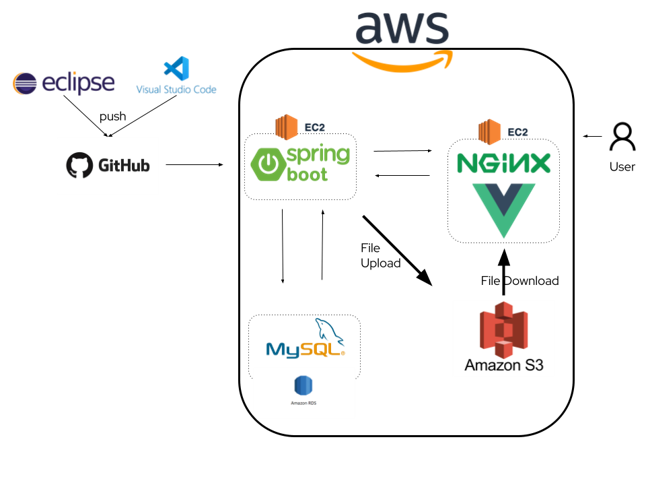
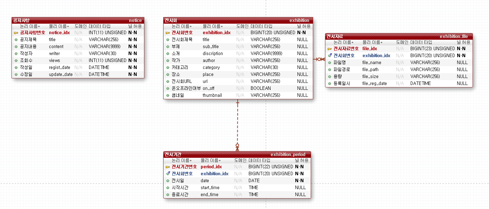

# 아트 팜 - Art Farm (2021.12 ~ 2022.01)
> 아마추어(또는 무명)아티스트들을 위한 전시회 소개 웹 서비스

 

## 주요 기능
* 온라인 전시자료 업로드
* 온/오프라인 전시정보 제공

## 사용 기술
* Java 8
* Spring Boot 2.6.2
* Gradle 7.3.1
* Spring Data JPA
* Vue.js

## 제작 기간 & 참여 인원

* [견종빈](https://github.com/jbGyeon) - 프론트엔드 개발 보조, 기획 
* [김인표](https://github.com/kiminpyo) - 프론트엔드 개발
* [김인환](https://github.com/inhwanK) - 백엔드 개발

## 리포지토리
* [Front-end 저장소](https://github.com/kiminpyo/artfarm-front)
* [Back-end 저장소 (현재 리포지토리)](https://github.com/inhwanK/artfarm)

## 서버 구조도

## ERD

